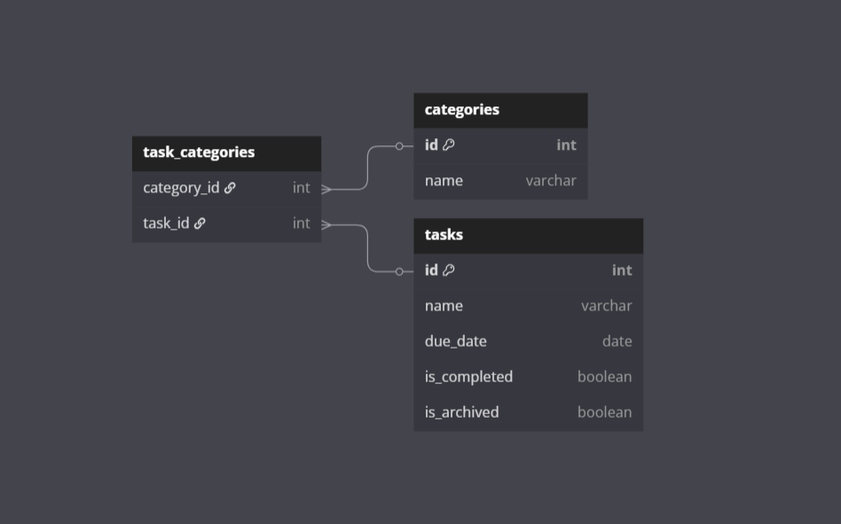

# Todos Spring Boot API

Welcome to my first full-stack App project! Here are some notes how I built this app, how to run it and more details on how it works.

## 🚀 1. Getting Started: Backend Spring Boot API

### Prerequisites

- [Java 17+](https://adoptopenjdk.net/) (or your project’s required version)
- [Maven](https://maven.apache.org/) (or use the Maven wrapper: `./mvnw`/`mvnw.cmd`)
- [MySQL](https://www.mysql.com/) (or your configured database)
- (Optional) [Postman](https://www.postman.com/) or similar tool for API testing

### Steps

#### 1. Clone the Repository

- [Github Link](https://github.com/carriegale2710/todos-app)

```sh
git clone https://github.com/carriegale2710/todos-app.git
cd todos-app
```

#### 2. Configure the Database

- Create a MySQL database (e.g., `todos`).
- Update `src/main/resources/application.properties` with your DB credentials:
  ```
  spring.datasource.url=jdbc:mysql://localhost:3306/tasks
  spring.datasource.username=YOUR_USERNAME
  spring.datasource.password=YOUR_PASSWORD
  ```

#### 3. Build the Project

```sh
mvn clean install
```

#### 4. Run the Application

```sh
mvn spring-boot:run
```

or

```sh
java -jar target/todos-app-0.0.1-SNAPSHOT.jar
```

#### 5. Access the API

- The API will be available at: `http://localhost:8080`
- Example endpoints:
  - `GET /tasks`
  - `POST /tasks`
  - `GET /categories`

#### 6. (Optional) Seed Development Data

- The app seeds data automatically in the `dev` profile if the database is empty.

---

**Troubleshooting:**

- If you get DB connection errors, check your MySQL is running and credentials are correct.
- For port conflicts, change `server.port` in `application.properties`.

---

### 🛠️ Testing the API

You can now run the API. Use [Postman](https://www.postman.com/) or a similar tool to check and interact with the API endpoints.

For example, you can send `GET` requests to:

- `http://localhost:8080/tasks`
- `http://localhost:8080/categories`

---

---

## 2. Project Documentation: How the API works

---

Here is more infomation about the how this project was scoped, how it was designed and how it works.

### Project Scope - Backend MVP (Spring API)

---

MVP: Create an API to be integrated with your [todos-ui](frontend/README.md) project, that allows you to store and retrieve tasks from a database.

- [x] Categories and Todos should be stored in separate tables
- [ ] Deleting a task should set an `isArchived` flag in the database instead of deleting the task from the database
- [/] Add a filter to the frontend application that allows you to filter tasks by category

### Backend Functionality

---

| Features Built                | CRUD Actions         |
| ----------------------------- | -------------------- |
| Add/delete **categories**     | ✅ Create, Delete    |
| Add/update/delete **tasks**   | ✅ Full CRUD         |
| Tag tasks with **categories** | ✅ Relationship      |
| Duplicate tasks               | ✅ Bonus-style logic |

### CRUD Endpoints for Fetching Data from API

---

#### Tasks Endpoints:

    - [x] `GET /tasks`
    - [/] `GET /tasks?category={}` //query parameters
    - [x] `POST /tasks` //also use for duplication
    - [/] `PUT /tasks/:id` //fix categories
    - [x] `DELETE /tasks/:id`

Note: For `POST`/`UPDATE` Requests, use this data format:

```json
task
{
    "name": "Create a Spring project", //String
    "dueDate": "2025-06-01", //Date
    "isCompleted": true, //Boolean
    "categories": ["coding", "backend"] //String ArrayList
}
```

#### Categories Endpoints:

- [x] `GET /categories`
- [x] `POST /categories`
- [x] `PUT /categories/:id`
- [x] `DELETE /categories/:id`

Note: For `POST`/`UPDATE` Requests, use this data format:

```json
category
{
    "name": "coding" //String
}
```

## Database Relationships

### Many-to-Many Relationship

The DB in my Todos app uses a **many-to-many relationship**:

- Each **task** can have _multiple tagged categories_.
- Each **category** can have _multiple associated tasks_.

#### How it is it setup?

It uses `task_categories` as an intermediate table (also known as a junction or linking table) that contains foreign keys referencing both related tables.


[Link](https://dbdiagram.io/d/To-do-App-684ae6371dff20a534caf9d8)

### Entity Tables

---

#### 1. `categories`:

```
- id INT PRIMARY KEY
- name VARCHAR
```

#### 2. `tasks`:

```
- id INT PRIMARY KEY
- name VARCHAR
- due_date DATE
- is_completed BOOLEAN
- is_archived BOOLEAN
- categories JSON or String[]
```

---

## UP NEXT

### ✅ Task Duplication Logic (in backend)

- [ ] GET task by ID
- [ ] Copy its name & category_id
- [ ] Save as new task

### Ideas for later features:

- Sophisticated UI
  - kanban board on web UI
- Notifications
  - alarm reminders for due tasks
- Filters
  - category groups eg. PARA systems
- Countdown/pomodoro timers

## REFERENCES

- [Spring Framework Diagram](assets/spring_framework.png)
- [Faker API](https://javadoc.io/doc/com.github.javafaker/javafaker/1.0.2/index.html)
- [ER Diagrams](https://www.lucidchart.com/pages/er-diagrams)
- [One-to-One vs One-to-Many Relationships](https://www.geeksforgeeks.org/sql/relationships-in-sql-one-to-one-one-to-many-many-to-many/)
