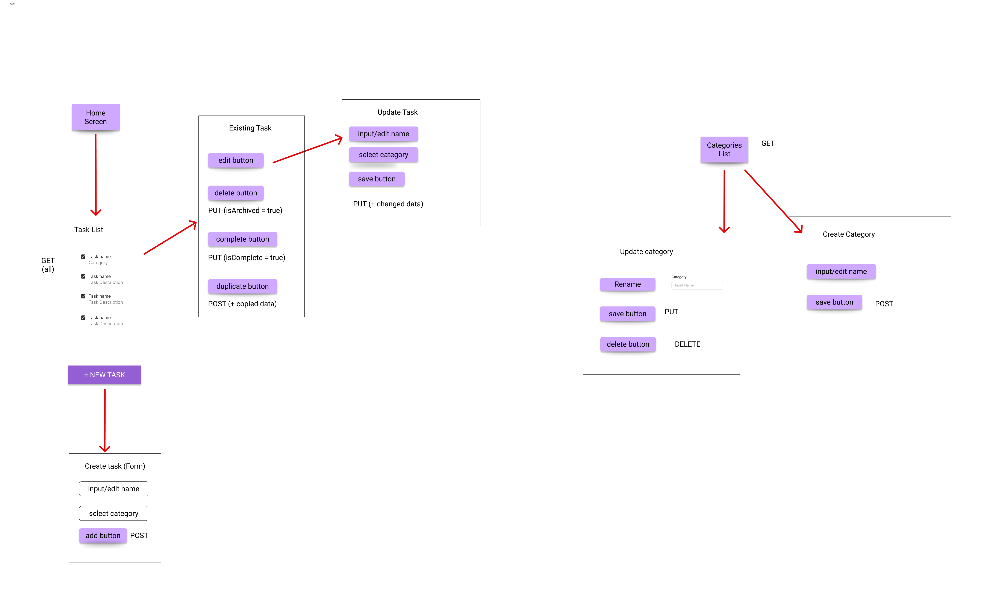

# Todos Spring Boot API

Welcome to my first full-stack App project! Here are some notes how I built this app, how to run it and more details on how it works.

## Demo & Snippets

- Include hosted link
- Include images of app if CLI or Client App

---

## Requirements / Purpose

### MVP

Create an API to be integrated with your [todos-ui](frontend/README.md) project, that allows you to store and retrieve tasks from a database.

- [x] Categories and Todos should be stored in separate tables
- [ ] Deleting a task should set an `isArchived` flag in the database instead of deleting the task from the database
- [/] Add a filter to the frontend application that allows you to filter tasks by category

### Purpose of Project

### Tech Stack used and why

Java, Spring + mySQL database.

---

## Build Steps

- how to build / run project
- use proper code snippets if there are any commands to run

### Prerequisites

- [Java 17+](https://adoptopenjdk.net/) (or your project’s required version)
- [Maven](https://maven.apache.org/) (or use the Maven wrapper: `./mvnw`/`mvnw.cmd`)
- [MySQL](https://www.mysql.com/) (or your configured database)
- (Optional) [Postman](https://www.postman.com/) or similar tool for API testing

### Steps

#### 1. Clone the Repository

- [Github Link](https://github.com/carriegale2710/todos-app)

```sh
git clone https://github.com/carriegale2710/todos-app.git
cd todos-app
```

#### 2. Configure the Database

- Create a MySQL database (e.g., `todos`).
- Update `src/main/resources/application.properties` with your DB credentials:
  ```
  spring.datasource.url=jdbc:mysql://localhost:3306/tasks
  spring.datasource.username=YOUR_USERNAME
  spring.datasource.password=YOUR_PASSWORD
  ```

#### 3. Build the Project

```sh
mvn clean install
```

#### 4. Run the Application

```sh
mvn spring-boot:run
```

or

```sh
java -jar target/todos-app-0.0.1-SNAPSHOT.jar
```

#### 5. Access the API

- The API will be available at: `http://localhost:8080`
- Example endpoints:
  - `GET /tasks`
  - `POST /tasks`
  - `GET /categories`

#### 6. (Optional) Seed Development Data

- The app seeds data automatically in the `dev` profile if the database is empty.

---

**Troubleshooting:**

- If you get DB connection errors, check your MySQL is running and credentials are correct.
- For port conflicts, change `server.port` in `application.properties`.

---

## Design Goals / Approach

Here is more infomation about the how this project was scoped, how it was designed and how it works.

- [ ] Design goals
- [ ] why did you implement this the way you did?

### Many-to-Many Database Relationship

The DB in my Todos app uses a **many-to-many relationship**:

- Each **task** can have _multiple tagged categories_.
- Each **category** can have _multiple associated tasks_.

#### How it is it setup?

It uses `task_categories` as an intermediate table (also known as a junction or linking table) that contains foreign keys referencing both related tables.


[Link](https://dbdiagram.io/d/To-do-App-684ae6371dff20a534caf9d8)

### Entity Tables

---

#### 1. `categories`:

```
- id INT PRIMARY KEY
- name VARCHAR
```

#### 2. `tasks`:

```
- id INT PRIMARY KEY
- name VARCHAR
- due_date DATE
- is_completed BOOLEAN
- is_archived BOOLEAN
- categories JSON or String[]
```

---

## Features

---

| Features Built                | CRUD Actions         |
| ----------------------------- | -------------------- |
| Add/delete **categories**     | ✅ Create, Delete    |
| Add/update/delete **tasks**   | ✅ Full CRUD         |
| Tag tasks with **categories** | ✅ Relationship      |
| Duplicate tasks               | ✅ Bonus-style logic |

### CRUD Endpoints for Fetching Data from API

---



#### Tasks Endpoints:

- [x] `GET /tasks`
- [ ] `GET /tasks?category={}` //query parameters
- [x] `POST /tasks` //also use for duplication
- [ ] `PUT /tasks/:id` //fix categories
- [x] `DELETE /tasks/:id`

Note: For `POST`/`UPDATE` Requests, use this data format:

```json
task
{
    "name": "Create a Spring project", //String
    "dueDate": "2025-06-01", //Date
    "isCompleted": true, //Boolean
    "categories": ["coding", "backend"] //String ArrayList
}
```

#### Categories Endpoints:

- [x] `GET /categories`
- [x] `POST /categories`
- [x] `PUT /categories/:id`
- [x] `DELETE /categories/:id`

Note: For `POST`/`UPDATE` Requests, use this data format:

```json
category
{
    "name": "coding" //String
}
```

---

## Known issues

Remaining bugs, things that have been left unfixed

- Security issues with mySQL password, implementing environment variables correctly

Features that are buggy / flimsy

- UPDATE not removing old categories

---

## Future Goals

What are the immediate features you'd add given more time:

Categories

- Can archive category names which removes it from categories prop in tasks
- Can unarchive category names for temp undo buttons
- Can edit category names and updates any tasks tagged by it

Tasks

- Adding a optional description for users to write short notes each task
- Filter tasks by more than one category using query parameters (move logic here from front-end)
- Set value of a new `priority` property on task entity upon creation + based on how far the due date is from current date, with maybe enum for DUE SOON, DUE TODAY, DUE LATER.

## Change logs

Write a paragraph labelled with the date every day you work on the project to discuss what you've done for the say. Be specific about the changes that have happened for that day.

### 13/02/2022 - {Theme of changes if applicable}

- Extended the expiry time of JWT tokens on the backend
- Added users to cohort response payload
- Centralized API base URL on frontend using the proxy `package.json` property

---

## Limitations & Setbacks

What did you struggle with? What? Why? How?

- Whether to repeat similar code for different classe entities between todos and categories
- Debating whether virtual properties should be used for either isArchived or isCompleted -> need them to be quickly updatable
- Upholding security with SQL environment variables not loading correctly

---

## Licensing Details

- What type of license are you releasing this under?

---

## Further details, related projects, reimplementations

### Front-end UI Client App

[Link](front-end)

### References used throughout project

- [Spring Framework Diagram](assets/spring_framework.png)
- [Faker API](https://javadoc.io/doc/com.github.javafaker/javafaker/1.0.2/index.html)
- [ER Diagrams](https://www.lucidchart.com/pages/er-diagrams)
- [One-to-One vs One-to-Many Relationships](https://www.geeksforgeeks.org/sql/relationships-in-sql-one-to-one-one-to-many-many-to-many/)
