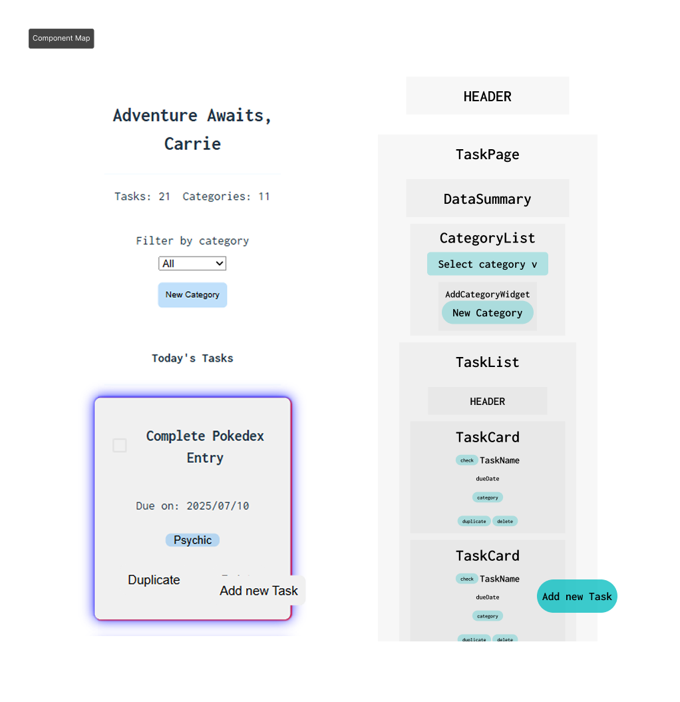
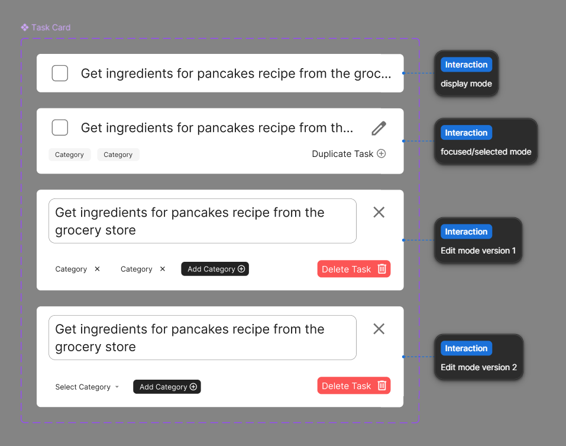
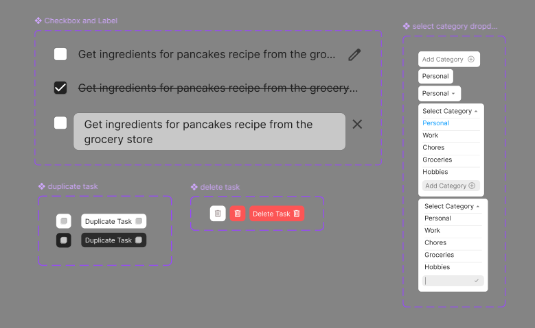
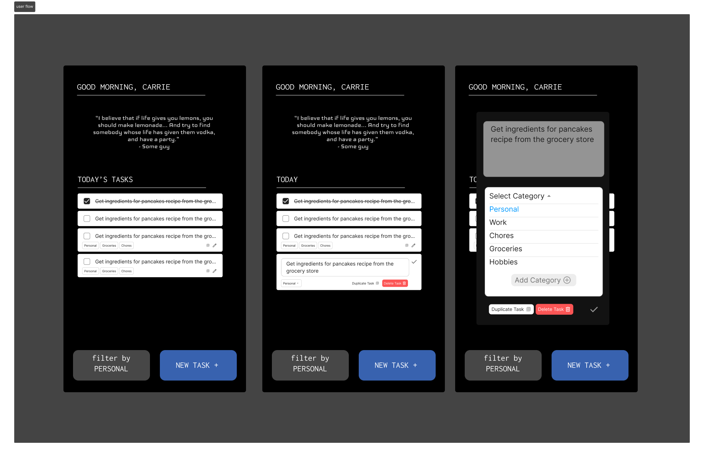

# Todos App - Frontend UI

- This Todos App front end UI was made with React (Vite) + Typescript.

---

## 🚀 Getting Started: Frontend React App UI

### Prerequisites

- [Node.js](https://nodejs.org/) (v18+ recommended)
- [npm](https://www.npmjs.com/) or [yarn](https://yarnpkg.com/)
- The backend Spring Boot API running (see backend README for setup)

### 1. Clone the Repository

```sh
git clone https://github.com/carriegale2710/todos-app.git
cd todos-app/front-end
```

### 2. Install Dependencies

```sh
npm install
# or
yarn install
```

### 3. Configure API Endpoint (if needed)

- By default, the frontend expects the backend API at `http://localhost:8080`.
- If your backend runs on a different port or host, update the API URLs in your frontend code (usually in a `services` or `config` file).

### 4. Run the Frontend App

```sh
npm start
# or
yarn start
```

- The app will open at [http://localhost:3000](http://localhost:3000) by default.

### 5. Using the App

- Make sure your backend API is running and accessible.
- You can now add, edit, delete, and filter tasks and categories through the UI.
- Use [Postman](https://www.postman.com/) or your browser’s dev tools to inspect API requests and responses.

---

**Troubleshooting:**

- If you see errors about failing to fetch data, ensure the backend API is running and CORS is configured if accessing from a different host/port.
- For port conflicts, change the frontend port in `package.json` or with the `PORT` environment variable.

---

You can now develop and test the React frontend with the Spring Boot backend :D

---

---

# PROJECT DOCUMENTATION

---

## 📋 Project Scope - React UI MVP

MVP: Create an application in React that allows you to track, add, and delete tasks as well as manage categories of tasks.

### Front-end Features

This is just a summary of what the frontend should be doing:


#### MVP

- [ ] Must be able to add categories
- [ ] Must be able to add new tasks tagged with a task category
- [ ] Must be able to update tasks automatically by changing the task name and the category
- [ ] Must be able to duplicate tasks
- [ ] Must be able to delete tasks
- [ ] You must add your own styling

#### Bonus

- [ ] Come up with a feature that allows us to delete and update task categories
- [ ] Create a summary section that lists how many of each type of task there are

## UI Developer Documentation

Techstack: React + TypeScript

### Interactive Flow 🧭

```plaintext
1. View tasks (optional: filter by category)
2. Add task → enter name, pick category, submit
3. Edit task → inline name/category change
4. Delete task → set isArchived = true
5. Duplicate task → clone task
6. Manage categories → add (bonus: edit/delete)
7. (Bonus) View summary of task counts per category
```

## 🧱 React Components

**Start with these components:**

```plaintext
App.tsx              → main layout + data
CategoryForm.tsx     → add category
CategoryList.tsx     → show categories
TaskForm.tsx         → add task
TaskList.tsx         → render tasks
TaskItem.tsx         → edit, duplicate, delete task
(Optional) CategoryFilter.tsx
(Optional) SummaryBar.tsx
```

### Categories

- `CategoryForm`: Add category (input + button)
- `CategoryList`: Show all categories
  _(Bonus: edit/delete options)_

### Tasks

- `TaskForm`: Add task (name + category dropdown)
- `TaskList`: Displays tasks (supports filtering)
- `TaskItem`:

  - Editable name & category
  - Complete checkbox
  - Buttons: **Duplicate**, **Delete**

### Bonus

- `CategoryFilter`: Dropdown to filter by category
- `SummaryBar`: Shows “Work: 3, Study: 2” etc.

---

## Design Documentation

### Wireframes


28/06/25 - Home Page (App.tsx)


### UI MoodBoard


### Mockups

TaskCard Component:


Smaller Components:


User Flow:


## 🧠 BONUS IDEAS

---

### Daily Quotes API Bonus Feature

- [ ] Use a free API to show a random quote when you open the app: https://api-ninjas.com/api/quotes

## REFERENCES & RESOURCES

---

### Typography & Fonts

- [Google Fonts API](https://developers.google.com/fonts/docs/css2)
- [Using Variables Fonts on Web](https://fonts.google.com/knowledge/using_type/loading_variable_fonts_on_the_web)

### Icons

- [Google Material Symbols & Icons](https://fonts.google.com/icons)
- [Material Icons Guide](https://developers.google.com/fonts/docs/material_icons)

- [Ditto Icon](https://www.flaticon.com/free-icon/avatar_1752681?term=pokemon&page=1&position=1&origin=tag&related_id=1752681)
