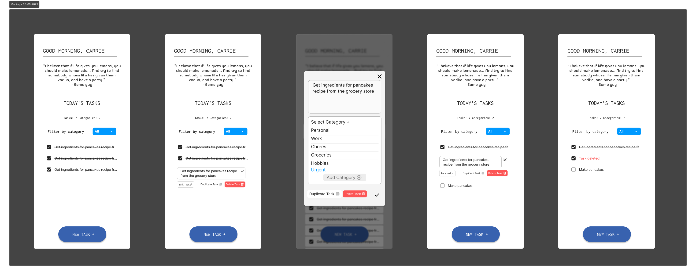

# Todos App - Frontend UI Documentation

---

Note: Please refer to `Getting Started` guide at bottom of the page for running this app in your local browser.

## 📋 Project Overview

Goal: Create an application in React that allows you to track, add, and delete tasks as well as manage categories of tasks

### Feature requirements


#### MVP Features

- [x] Must be able to duplicate tasks
- [x] Must be able to add categories
- [x] Must be able to add new tasks tagged with a task category
- [ ] Must be able to delete tasks
- [ ] Must be able to update tasks automatically by changing the task name and the category
- [ ] You must add your own styling (In Progress)

#### Bonus Features

- [ ] Create a summary section that lists how many of each type of task there are
- [ ] Come up with a feature that allows us to delete and update task categories
- [x] Use a free API to show a random quote when you open the app: https://api-ninjas.com/api/quotes
  - [ ] Move this to backend for better security
- [ ] Implement 'Advanced filter' feature that lets you filter by more than one category

## React Components

### Categories

- [x] `CategoryForm`: Add category (input + button)
- [x] `CategoryList`: Show all categories
      _(Bonus: edit/delete options)_

### Tasks

- [x] `TaskForm`: Add task (name + category dropdown)
- [x] `TaskList`: Displays tasks (supports filtering)
- [] `Task`:

  - [ ] Editable name & category
  - [ ] Complete checkbox
  - [ ] Buttons:
        [ ] **Duplicate**,
        [ ] **Delete**

### Bonus

- [x] `CategoryFilter`: Dropdown to filter by category
- [ ] `SummaryBar`: Shows “Work: 3, Study: 2” etc.

## User Flows + Side Effects 🧭

### TASKS

```
1. View list of tasks:

-> Navigate to TasksPage ->  TaskList
-> taskData is fetched on first mount + if changes occur
-> list of TaskCards with taskData displayed

```

```
2. Add a new task:

-> Click 'add task' button in Tasks/Home Page
-> Opens Modal with a TaskForm
  -> enter task name
  -> pick category (or add new one)
  -> submit
-> taskData sent to DB
-> DB re-fetched + synced to Tasklist context
```

```
3. Edit a task:

Enter new name/category change -> submit
```

```
4. Delete/Archive a task:

-> click delete/archive button
-> (opt): user warning
  -> click yes
→ set isArchived = true
```

```
5. Duplicate a task:

-> click on 'Duplicate' button on the task's TaskCard
-> implement `2. Add a new task` but with copied data

```

### CATEGORIES

```
1. View list of all categories:

-> Navigate to TasksPage ->  CategoryList
-> categoryData is fetched on first mount + if changes occur
-> list of CategoryTags with categoryData displayed

  1.a. bonus: (Adv) filter by category:
  -> click on the "CategoryTag" button
  -> taskList updates to show only those with that category
  -> click again

  1.b bonus: task counts per category:
  -> automatically updates number when changes occur
```

```
2. Add new category:

-> click on "New Category button"
-> Enter category name
-> click submit
-> user comfirmation message
-> new category appears in CategoryList
```

---

## UX/UI Design Process

### UI MoodBoard


### Wireframes

28/06/25 - Home Page (App.tsx)


### Prototypes

[View the interactive Figma prototype here.](https://www.figma.com/proto/4txnsEYq1FF7TvHc0vqp8O/Todos-App?page-id=18%3A122&node-id=54-6624&p=f&viewport=-8623%2C-2162%2C1&scaling=min-zoom&content-scaling=fixed&starting-point-node-id=54%3A2287)

Lofi Mockups :


## RESOURCES USED

### Typography & Fonts

- [Google Fonts API](https://developers.google.com/fonts/docs/css2)
- [Using Variables Fonts on Web](https://fonts.google.com/knowledge/using_type/loading_variable_fonts_on_the_web)

### Icons

- [Google Material Symbols & Icons](https://fonts.google.com/icons)
- [Material Icons Guide](https://developers.google.com/fonts/docs/material_icons)

- [Ditto Icon](https://www.flaticon.com/free-icon/avatar_1752681?term=pokemon&page=1&position=1&origin=tag&related_id=1752681)

---

## 🚀 Getting Started: Running App in Local Browser

- This Todos App front end UI was made in a VS Code IDE with React (Vite) + Typescript.

### Prerequisites

- [Node.js](https://nodejs.org/) (v18+ recommended)
- [npm](https://www.npmjs.com/) or [yarn](https://yarnpkg.com/)
- The backend Spring Boot API running (see backend README for setup)

### 1. Clone the Repository

```sh
git clone https://github.com/carriegale2710/todos-app.git
cd todos-app/front-end
```

### 2. Install Dependencies

```sh
npm install
# or
yarn install
```

### 3. Configure API Endpoint (if needed)

- By default, the frontend expects the backend API at `http://localhost:8080`.
- If your backend runs on a different port or host, update the API URLs in your frontend code (usually in a `services` or `config` file).

### 4. Run the Frontend App

```sh
npm start
# or
yarn start
```

- The app will open at [http://localhost:3000](http://localhost:3000) by default.

### 5. Using the App

- Make sure your backend API is running and accessible.
- You can now add, edit, delete, and filter tasks and categories through the UI.
- Use [Postman](https://www.postman.com/) or your browser’s dev tools to inspect API requests and responses.

---

**Troubleshooting:**

- If you see errors about failing to fetch data, ensure the backend API is running and CORS is configured if accessing from a different host/port.
- For port conflicts, change the frontend port in `package.json` or with the `PORT` environment variable.

---
