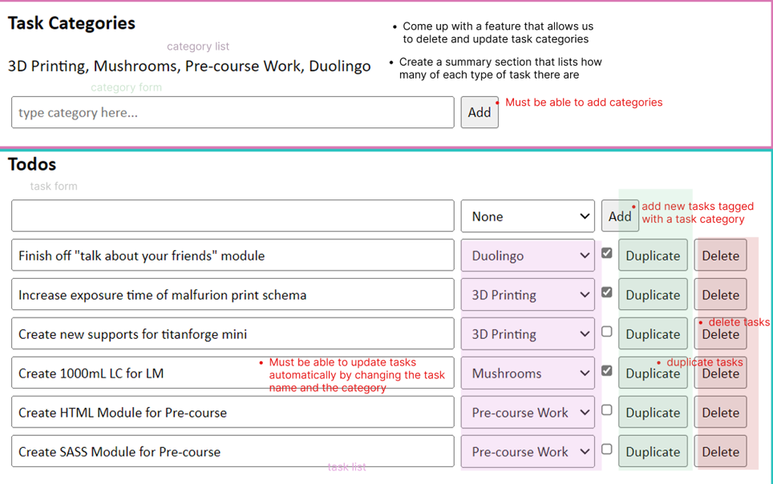

# Todos App UI

- React + Typescript

## 📋 Project Scope

Task: Create an application in React that allows you to track, add, and delete tasks as well as manage categories of tasks.

### Front-end Features

This is just a summary of what the frontend should be doing:



#### MVP

- [ ] Must be able to add categories
- [ ] Must be able to add new tasks tagged with a task category
- [ ] Must be able to update tasks automatically by changing the task name and the category
- [ ] Must be able to duplicate tasks
- [ ] Must be able to delete tasks
- [ ] You must add your own styling

#### Bonus

- [ ] Come up with a feature that allows us to delete and update task categories
- [ ] Create a summary section that lists how many of each type of task there are

## UI Developer Documentation

Techstack: React + TypeScript

### Interactive Flow 🧭

```plaintext
1. View tasks (optional: filter by category)
2. Add task → enter name, pick category, submit
3. Edit task → inline name/category change
4. Delete task → set isArchived = true
5. Duplicate task → clone task
6. Manage categories → add (bonus: edit/delete)
7. (Bonus) View summary of task counts per category
```

## 🧱 React Components

**Start with these components:**

```plaintext
App.tsx              → main layout + data
CategoryForm.tsx     → add category
CategoryList.tsx     → show categories
TodoForm.tsx         → add task
TodoList.tsx         → render tasks
TodoItem.tsx         → edit, duplicate, delete task
(Optional) CategoryFilter.tsx
(Optional) SummaryBar.tsx
```

### Categories

- `CategoryForm`: Add category (input + button)
- `CategoryList`: Show all categories
  _(Bonus: edit/delete options)_

### Tasks

- `TodoForm`: Add task (name + category dropdown)
- `TodoList`: Displays tasks (supports filtering)
- `TodoItem`:

  - Editable name & category
  - Complete checkbox
  - Buttons: **Duplicate**, **Delete**

### Bonus

- `CategoryFilter`: Dropdown to filter by category
- `SummaryBar`: Shows “Work: 3, Study: 2” etc.

---

## Design Documentation

### UI MoodBoard


## 🧠 BONUS IDEAS

---

### Daily Quotes API Bonus Feature

- [ ] Use this free API to show a random quote when you open the app:

- https://zenquotes.io/
- https://docs.zenquotes.io/zenquotes-documentation/

## REFERENCES

---
